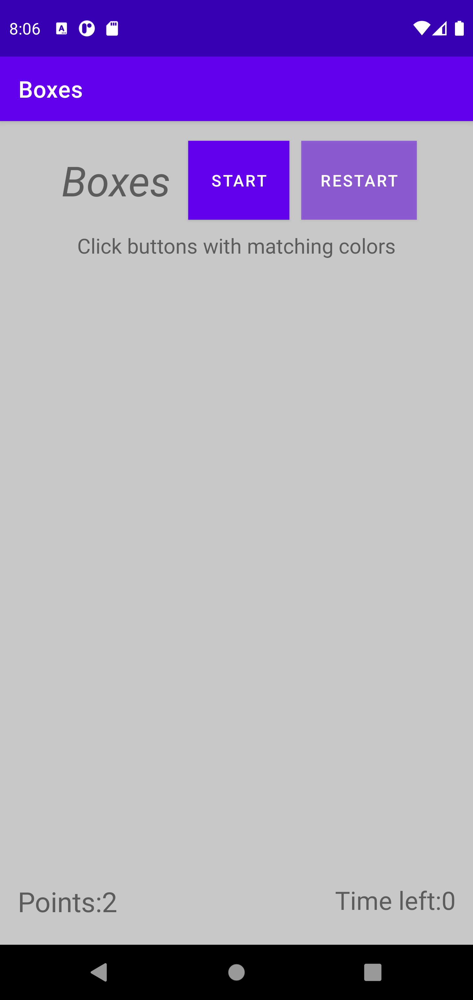
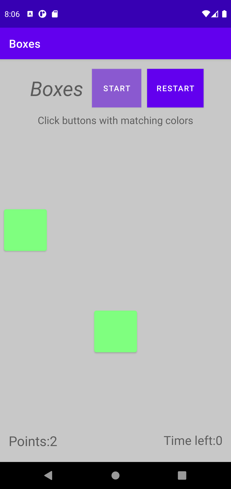
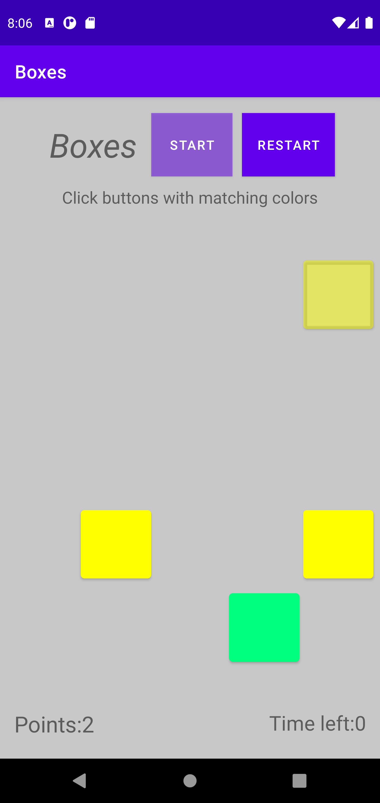

# Boxes
Android Project

Ze względu na to że nie mogłem znaleźć dokładnych wymagań aplikacji i brak czasu przez nadmiar pracy aplikacja jest bardziej na poziomie proof of concept niż pełnoprawnej aplikacji
Chętnie rozwinę ją bardziej w celu podniesienia oceny

Składa się z 6 funkcji z następującym flowem:

  **onCreate()** - Definiuje tutaj guziki i pola tekstowe a także Arraye guzików i kolorów.
                   Kolory są pseudolosowe, w pliku colors.xml stworzyłem listę 29 kolorów i iteruje po niej używając TypedArray.
                
  **startHandler()** - Ustawiam tutaj stan guzika, używam funkcji addPair po czym zmieniam zmieniam flagę isStarted na true.
  
  **addPair()** - Używając funkcji selectButtons() otrzymuję 3 losowe guziki z listy allButtons[], wybieram pseudolosowy kolor i zmieniam stan 3 wcześniej ustalonych guzików.
  
  **selectButtons()** - używając klasy Random wybieram 3 lub 2 niepowtarzające się guziki (w zalezności od isStarted).
  
  **clickHandler()** - Gra polega na łączeniu par więc do zapisu które kliknięcie jest wykonywane użyłem publicznej flagi typu boolean.
                       W przypadku gdy warunek połączenia zostaje spełniony guziki są ukrywane, punkt dodawany i następuje generowanie nowych guzików.
                       
  **restartHandler()** - Ze względu na naturę aplikacji jej restart nie wpływa na sam program a na widoczne wartości które są resetowane do stanu początkowego.
  
  Screenshoty
  
  **Start**
  
  
  **Po kliknieciu start**
  
  
  **Po kliknieciu pierwszej pary**
  
  
  **Słabej jakości gif (Komputer nie daje rady)**
  
  
  
